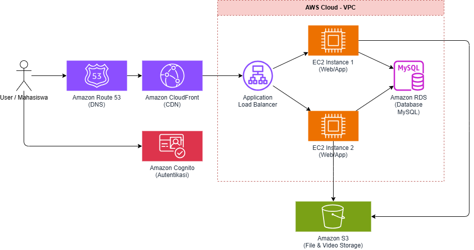

# elearning-cloud-architecture
# 📚 E-Learning Cloud Platform - Universitas Palangka Raya

Repositori ini berisi perencanaan arsitektur, *Infrastructure as Code* (IaC), dan *source code* untuk platform E-Learning berbasis *Cloud* (AWS). Proyek ini merupakan Final Project untuk mata kuliah Cloud Computing.

## 🏗 Topologi & Arsitektur Sistem
Sistem ini dirancang menggunakan arsitektur *High-Availability* dan *Multi-Tier* di dalam AWS VPC:
* **Frontend/Backend Compute:** Amazon EC2 (Auto Scaling) & Application Load Balancer
* **Database Tier:** Amazon RDS (MySQL)
* **Storage & CDN:** Amazon S3 & CloudFront
* **Authentication & DNS:** Amazon Cognito & Route 53

 
*(Catatan: Nanti *upload* gambar diagram draw.io kalian ke folder docs, lalu pastikan namanya architecture.png agar muncul di sini)*

## 📂 Struktur Direktori
* `/terraform`: Berisi skrip IaC (Terraform) untuk *provisioning* infrastruktur AWS.
* `/app`: Berisi *source code* logika aplikasi *e-learning* (Backend/Frontend).
* `/docs`: Berisi dokumen perencanaan proyek (PDF), diagram arsitektur, dan slide presentasi.

## 👥 Tim Pengembang (Kelompok X)
| Peran | Nama Anggota | Tanggung Jawab Utama |
| :--- | :--- | :--- |
| **DevOps & Security Engineer** | [Tulis Namamu] | Setup Git, Branch Protection, Terraform, IAM Policies, & Security Groups. |
| **Cloud Architect** | [Tulis Nama Teman 1] | Desain Diagram Draw.io, Perencanaan VPC/Subnet, & Estimasi Biaya AWS. |
| **Backend/App Dev** | [Tulis Nama Teman 2] | Integrasi Aplikasi, Skema Database MySQL, & Koneksi API ke S3. |

## 🚀 Alur Kerja (Git Flow)
Kami menggunakan metode *branching* dengan *Branch Protection* aktif di `main`.
1. `main` (Production): Kode yang sudah stabil dan berjalan di AWS.
2. `develop` (Development): Tempat menggabungkan fitur baru.
3. `feature/*`: Cabang untuk setiap anggota mengerjakan tugas masing-masing sebelum melakukan *Pull Request* ke `develop`.
